title: Photography: Volume 4
date: 2012-10-25 15:11
author: Arnav Dhamija
tags: Photography
category: Album
slug: photography-volume-4

Hi guys! Recently bought myself some free time to publish a brand new blog
post, centred on my photography work!

I guess I also owe all of my avid readers an apology: it's been a really long
time since my last photography post, so I hope I can make it up to you in this
one!

My previous photography posts:

[Volume 3](/photography-volume-3)

[Volume 2](/photography-volume-2)

[Volume 1](/photography)

As usual, just click to enlarge!

Starting off:

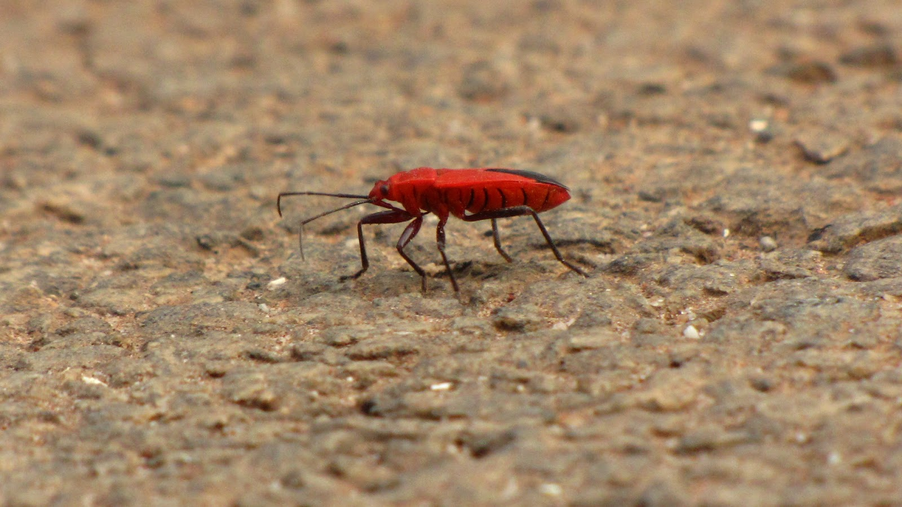

I'm really in need of an anthropologist here. I found this insect whilst
walking down the road when a speck of orange caught my eye. Turns out that
that speck of orange is one of the finest six-legged creatures I've ever seen.
From a photography stand-point, I used a wide aperture, and a large zoom to
capture this.

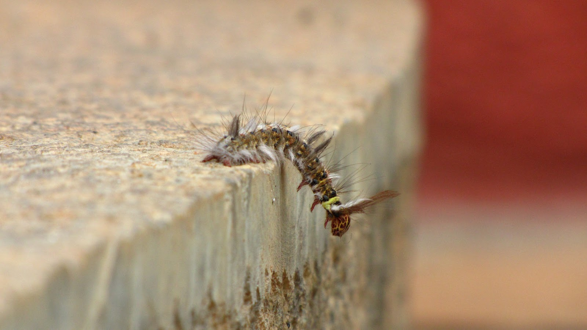

This is probably one of the most comical insect/bug pictures that I've ever
taken. The DoF worked excellently over here; it only puts the subject in
focus. The first thing that came to my mind after I shot this was "suicide".
Definitely one of my favourite shots.

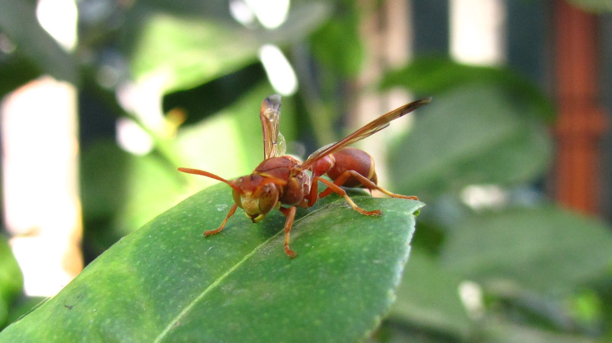

Yay, another bug! I'm really scared of wasps, but that's the good thing about
a superzoom camera: you can stand far away and still get a crisp shot. Pretty
much the same ingredients were used to make this shot as the previous two.

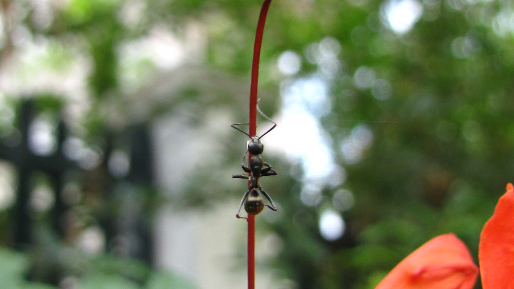

I should really call this post "Bugs and Insects Special Album!" or something.
Poor jokes aside, I love the way the insect was climbing on the stigma/anthers
(not too sure) of the flower. The background is sublimely blurred, but there's
still enough detail to keep the background interesting. Top shot.

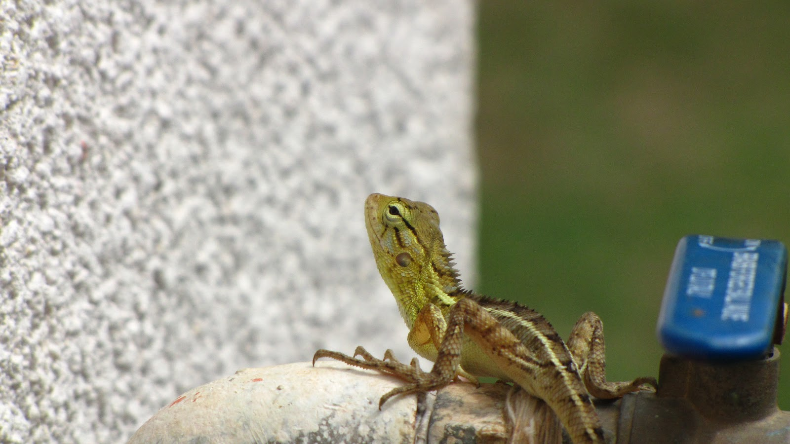

This is one picture I really like, but sometimes I feel remorseful seeing it.
Although the reptile is in excellent focus, the handle of the water tap to the
right distracts attention from it. Just goes to show that you can't always
expect perfect conditions for photography.

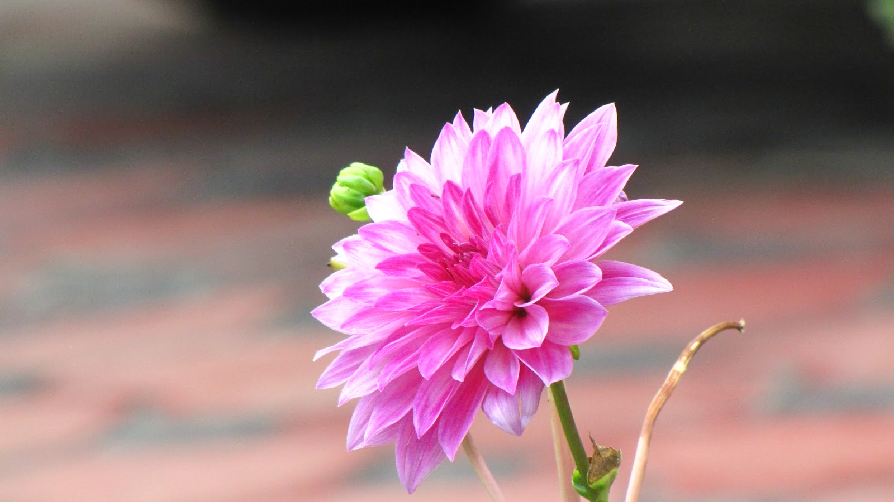

No photography album is complete without a good flower. This is easily one of
the prettiest flowers I've ever shot. Although I'm not too happy with the
background, the foreground more than makes up for it.

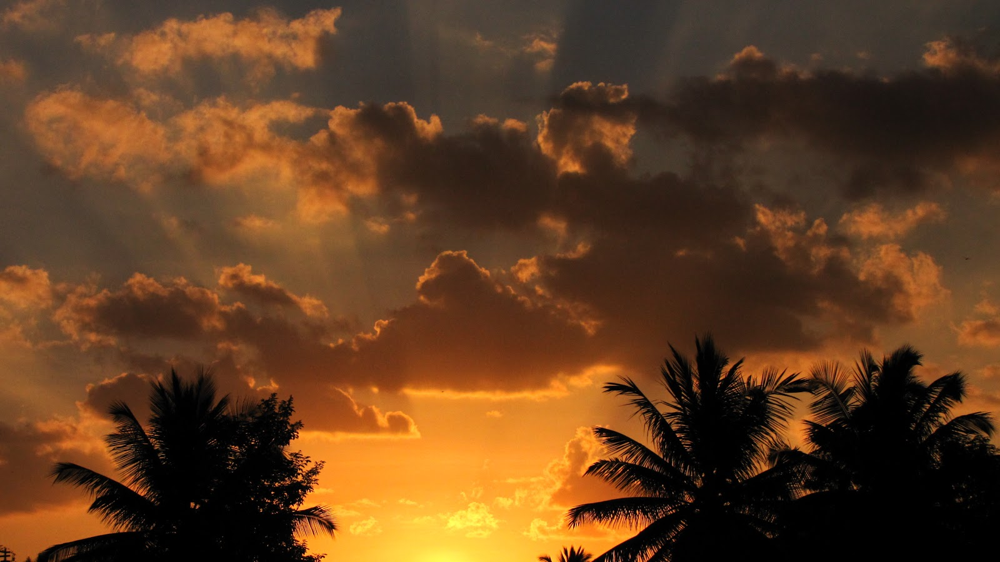

You're probably sick of seeing close-ups now, so I thought I'd throw in this
picture that I took at sunset.  Everything worked in this photo, the orange
clouds, the lovely Tyndall effect coming from the sun, and the coconut trees
below.

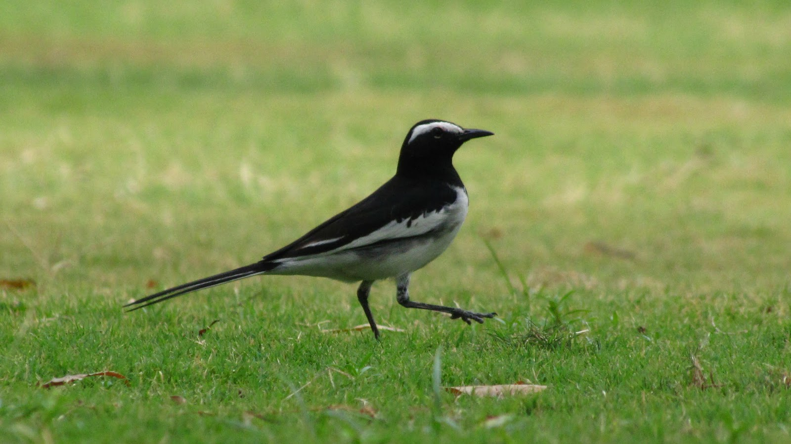

Another close-up! If I had to pass any comment about this, I would point out
the robin's leisurely stride. It seems so relaxed, almost as if in a dream-
like trance. Never mind my comments, post your own!

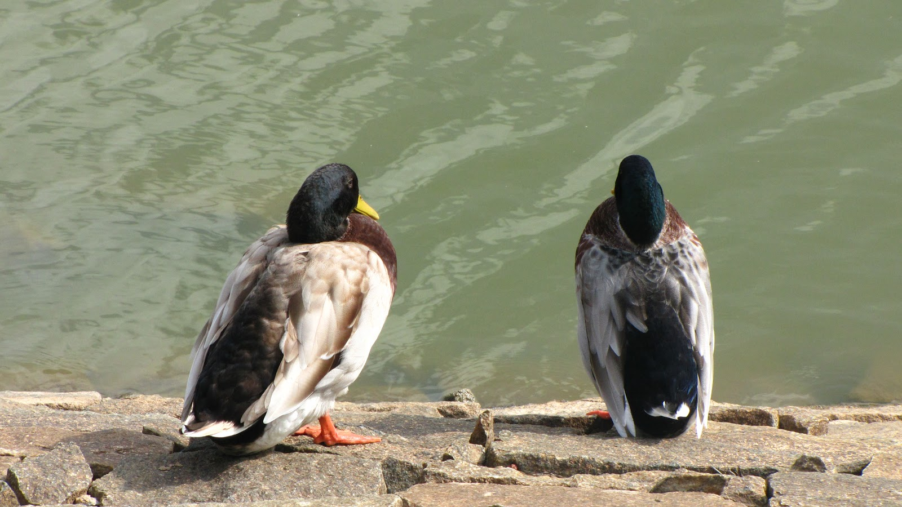

I really like this one. It's a very personified shot, the way the bird on the
left is trying to say something, and the one on the right is taciturn and
unwilling to respond. Their seating on the rocks is perfect and I also like
the way they chose to pose right in front of the water-body.

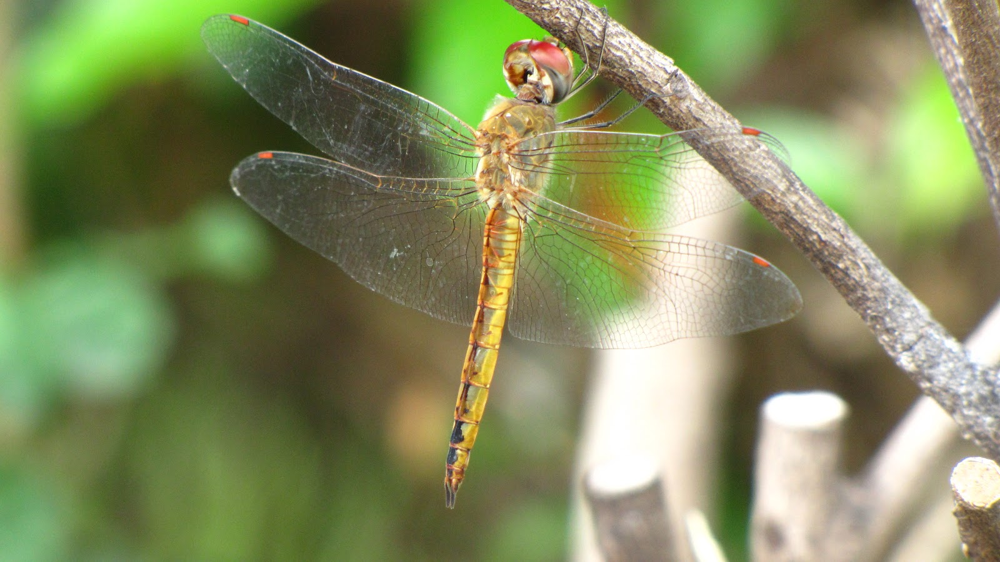

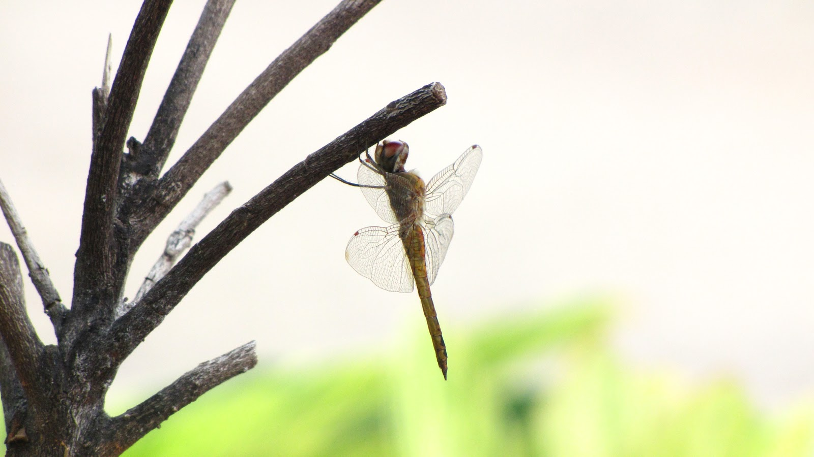

I'm sorry if I've made you wince by showing you another insect picture (it has
been enough of those!). Nevertheless, I'm really proud about taking these
shots. They're both images of the same dragonfly from different angles. The
first one has a nice background and excellent detail, while the second one
exhibits a minimalistic appearance, with little to distract from the dragonfly
itself.

That's all for now! Please criticize, praise, and comment!
